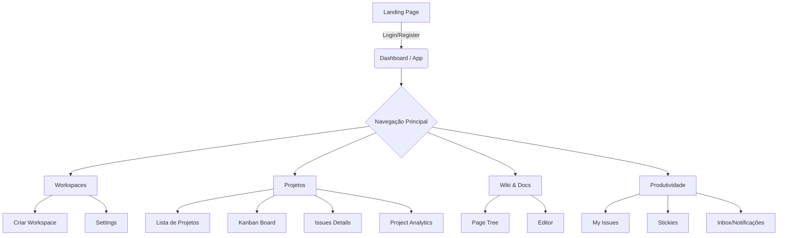
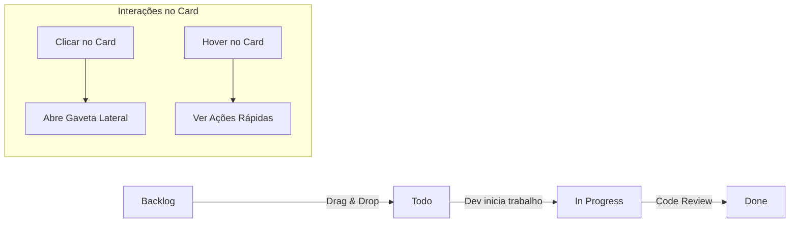
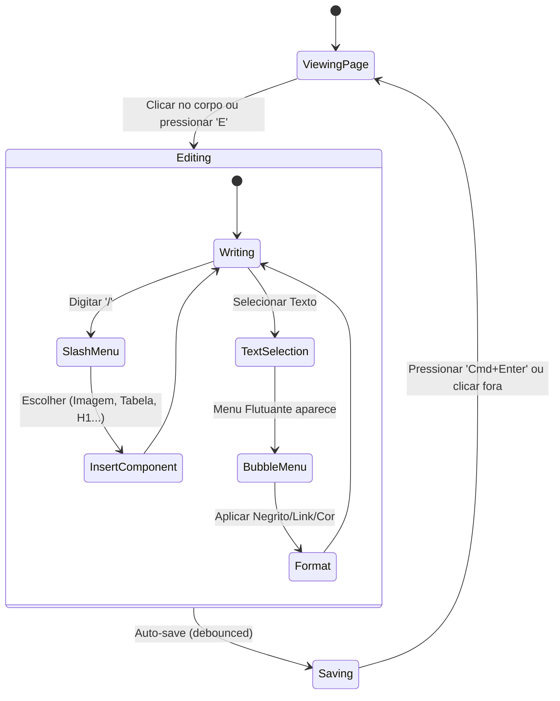

# AERO - Fluxos de Usuário (User Flows)

Este documento mapeia os principais fluxos de interação do usuário no AERO, servindo como guia para o design de interface e experiência.

---

## 1. Visão Geral (Sitemap)

---

## 2. Fluxo de Autenticação e Onboarding

O objetivo é levar o usuário ao "Aha Moment" (criar a primeira task) o mais rápido possível.

```mermaid
sequenceDiagram
    participant User
    participant System
    
    User->>System: Acessa /register
    User->>System: Preenche Nome, Email, Senha
    System->>User: Cria conta e Loga automaticamente
    
    Note over User, System: Onboarding Inicial
    
    System->>User: Exibe modal "Criar Workspace"
    User->>System: Define Nome e slug (ex: "acme-corp")
    System->>User: Redireciona para /app/dashboard
    
    rect rgb(20, 20, 20)
        Note right of System: Empty State Inteligente
        System->>User: Mostra Dashboard vazio com "Quick Start Guide"
        User->>System: Clica em "Criar Primeiro Projeto"
    end
```

---

## 3. Fluxo de Gerenciamento de Tarefas (Core Loop)

### 3.1. Criação Rápida (Quick Capture)
O usuário está em qualquer lugar do app e lembra de algo.

1.  Usuário pressiona `C` (tecla de atalho global).
2.  Modal de criação abre instantaneamente (foco no input de Título).
3.  Usuário digita: "Revisar PR da autenticação".
4.  *Opcional:* Usuário pressiona `Tab` para campos extras (Assignee, Priority) ou usa comandos de texto (ex: "!high #backend").
5.  Usuário pressiona `Enter`.
6.  Issue criada e notificação "Toast" aparece com opção "Undo".

### 3.2. Triagem e Execução (Kanban)

**Detalhes da Gaveta (Drawer):**
*   Ao clicar em um card, ele não abre uma nova página (o que perde contexto layout), mas sim uma "Gaveta" (Drawer) que desliza da direita.
*   Isso permite ver o Board e a Issue simultaneamente.

---

## 4. Fluxo de Documentação (Wiki)

O fluxo de escrita deve ser ininterrupto ("Writer's Flow").

---

## 5. Navegação Via Teclado (Power User)

O "Command Menu" (`Cmd+K`) é o teletransporte do usuário.

**Cenário:** Usuário está lendo uma Spec na Wiki e quer ver o status de uma task relacionada.

1.  User: `Cmd+K`
2.  System: Abre barra de busca centralizada.
3.  User: Digita "login bug".
4.  System: Mostra lista de resultados mistos (Páginas, Issues, Projetos).
5.  User: Seta para baixo `↓` até a issue desejada.
6.  User: `Enter`.
7.  System: Navega imediatamente para a Issue.

---

## 6. Stickies (Notas Rápidas)

O Stickies atua como uma "Memória RAM" para o usuário.

1.  Usuário está no meio de uma tarefa complexa.
2.  Recebe uma informação aleatória ("A cor do botão deve ser #F00").
3.  Pressiona atalho (ex: `G` then `S` ou ícone na sidebar).
4.  Painel de Stickies abre (sobreposto ou dedicado).
5.  Cria nota rápida amarela.
6.  Volta ao trabalho original sem ter saído da tela.
